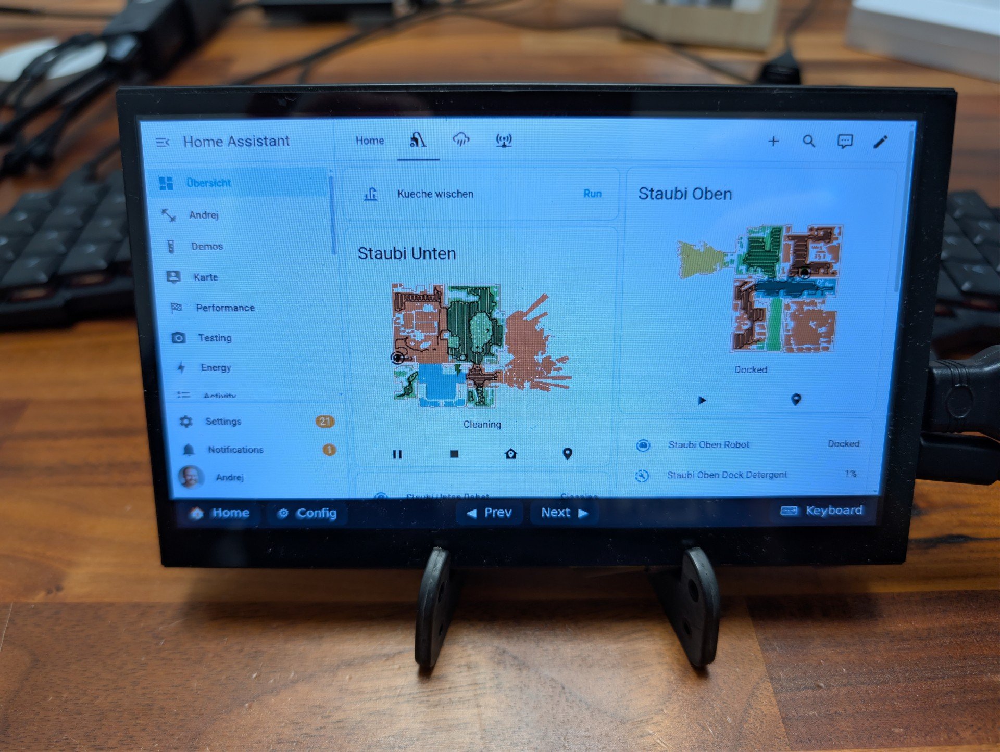
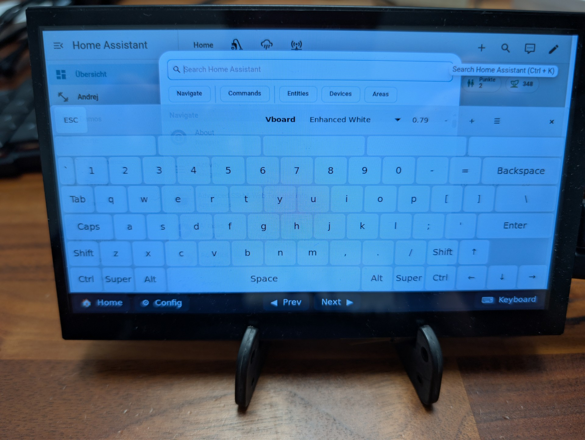
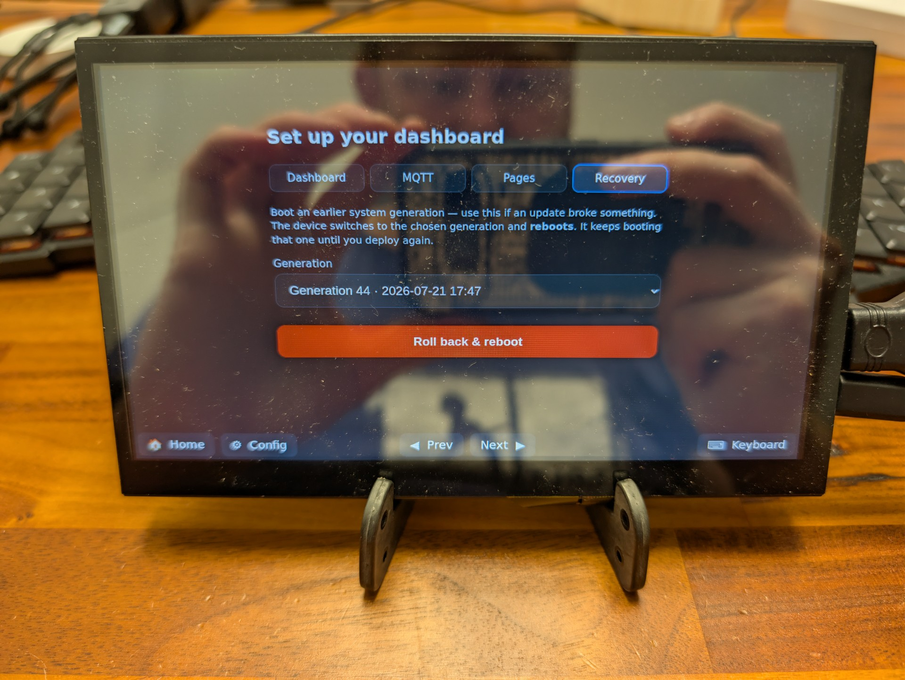
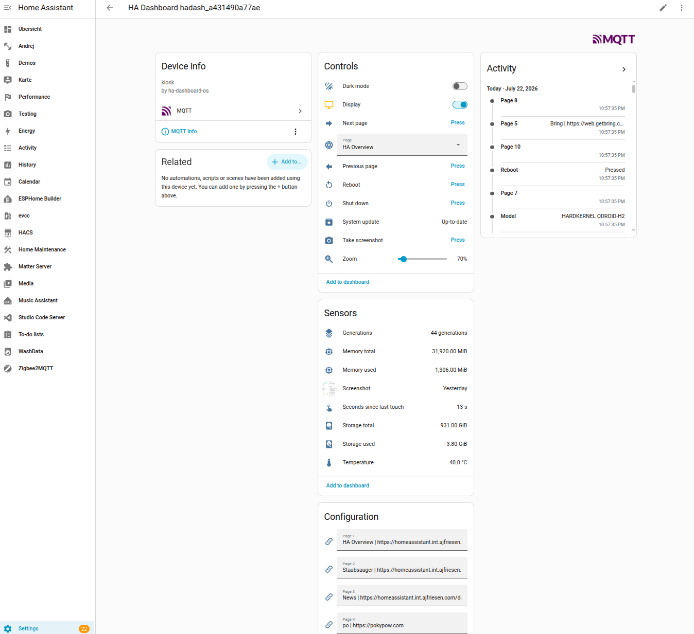
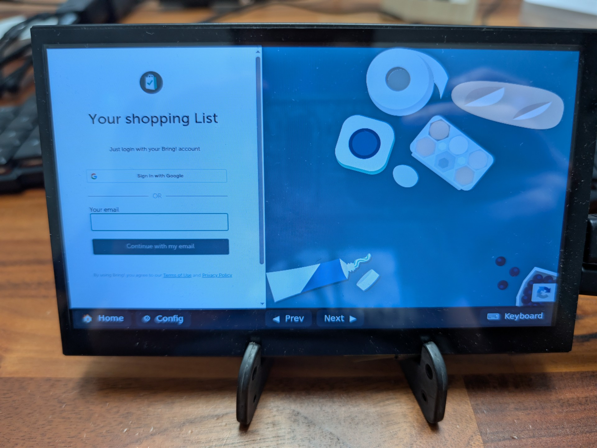
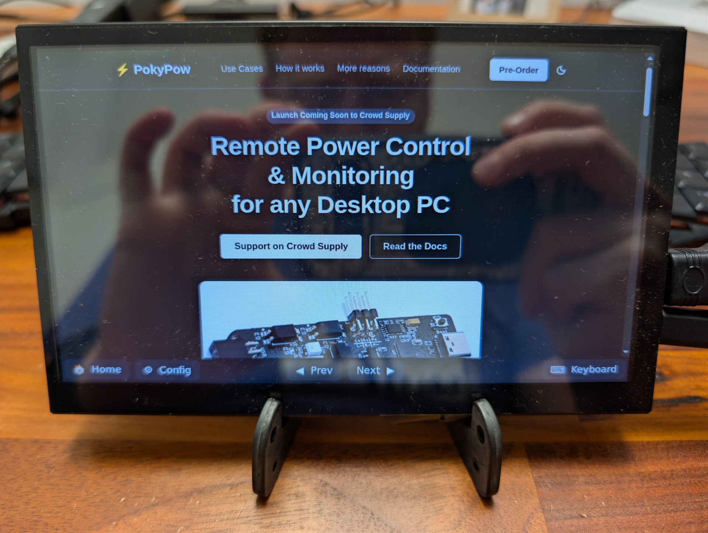

# Dashboard Assistant

**A declarative, unbreakable Home Assistant Kiosk OS built on NixOS.** Flash it to
a mini-PC or tablet, point it at your Home Assistant, and get a self-contained
wall dashboard that integrates *back* into HA over MQTT — so the screen itself
becomes something you can see and control from your automations.

  
  
  
   
  
  

> [!WARNING]
> This is in early development. Expect lots of changes.
> However, I am using this myself every day.

> [!NOTE]
> I am using AI and I disclose that.
> If you do not like that, close this tab and go touch grass.

> [!IMPORTANT]
> This is not affiliated to the Open Home Foundation or Home Assistant.
> This is my personal project.

---

- [Dashboard Assistant](#dashboard-assistant)
  - [Why](#why)
  - [Features](#features)
  - [Roadmap/Todos/Thoughts](#roadmaptodosthoughts)
  - [Credits](#credits)
  - [License](#license)
  - [Author](#author)

## Why

I was annoyed how much setup you needed in order to get a good dashboard experience.
Install some Linux Distribution, add packages, do this and that, configure things.
The motivation was born to make this easier, with no Linux knowledge needed.

- **Flash and go.** No Linux knowledge needed. Write one image, boot it, finish a
  short on-screen setup (Wi-Fi + HA URL), and it logs itself in.
- **Over-the-air updates.** Update the whole OS from Home Assistant.
- **Unbreakable.** It's NixOS. A bad update never bricks the wall panel — the
  device keeps every previous generation and boots the last working one
  automatically if a switch goes wrong (and you can roll back by hand).
- **Two-way Home Assistant integration.** Most kiosks *show* HA. This one also
  *appears in* HA: the display, brightness, zoom, theme, power, current page and
  device health are all MQTT entities you can automate. Turn off your display after sme time and turn on when motion has been detected.

## Features

Full-screen Chromium locked to your dashboard, multiple cyclable URLs, touch
wake, an on-screen keyboard, token auto-login, failed-boot rollback, atomic OTA
updates, and a first-boot Wi-Fi/HA setup wizard — all controllable from Home
Assistant, which auto-discovers the device as a set of MQTT entities.

See the [**Features**](https://ajfriesen.github.io/dashboard-assistant/features/)
page for the full list and the complete Home Assistant entity reference
(controls + sensors).

## Roadmap/Todos/Thoughts

- [ ] Raspberry Pi 4 and 5 support with the official touchscreen
- [ ] Testing Raspberry Pi 3 support
- [ ] Possibly more SBC boards
- [ ] Possibly Microsoft Surface Tablets
- [x] Fix touch keyboard
- [ ] Remove boot selection for generations on startup
- [ ] Make the installation smaller
- [ ] Track a NixOS Channel instead of unstable
- [ ] Check if the provision file can always be used instead only on first boot
- [ ] Adjust layout for menus, static nav bar on top
- [ ] Removing menu items, like pages
- [ ] Add flashable images somewhere
- [ ] Create a logo
- [ ] Add website + documentation
- [ ] Add live logs in config and allow copy paste
- [ ] Think bout allowing configuring the dashboard over the network
- [ ] Think about encryption

## Credits

Inspired by [TouchKio](https://github.com/leukipp/touchkio).

## License

Not yet licensed. Until a `LICENSE` file is added, all rights are reserved.

## Author

This project was created by Andrej Friesen in 2026.

